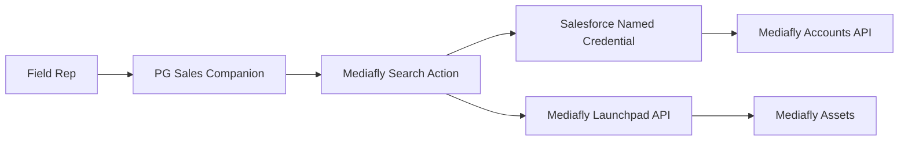

# Mediafly Agent Action Walkthrough

This guide describes a phase-two path for connecting the P&G Sales Companion to Mediafly. The goal is Level 1 content retrieval: a rep asks for sales materials, the agent searches Mediafly, and the agent returns a short ranked list of direct links back to Mediafly.

Mediafly remains the source of truth. Salesforce does not duplicate the content library, and Agentforce does not answer from inside the documents in this level of the integration.

## Target Use Case

The rep has already reviewed a pre-visit brief or is preparing for a customer conversation. They ask the agent for relevant materials:

```text
What materials do I have for Oral-B iO hygienist training?
Pull up the Gingivitis ER sell sheet.
Find assets for Crest Gum Detoxify.
```

The agent calls a Mediafly search action and responds with a short list:

```text
Here are the top Mediafly matches for "Oral-B iO hygienist training":

1. iO White Box Sampling Guide (PDF) - View in Mediafly: <mediafly-link>
2. Hygienist Integration Talking Points (PPT) - View in Mediafly: <mediafly-link>
3. Oral-B iO Patient Outcomes Video (MP4) - View in Mediafly: <mediafly-link>
```

The rep taps a link and opens the asset directly in Mediafly. If Mediafly requires user authentication to open the asset URL, the rep should be signed in to the Mediafly app or browser session as they normally would be during the sales day.

## Level 1 Architecture



The Agentforce action is intentionally separate from the pre-visit brief. The pre-visit brief stays grounded in Salesforce account, visit, order, and sampling data. Mediafly search is a separate request when the rep wants content to share or review.

## What P&G Needs From Mediafly

Before implementation, confirm these values with the Mediafly team:

- A dedicated Mediafly service account for API access. Do not use an individual rep's account.
- Read access for that service account to the content library in scope for the pilot or rollout.
- The `productId` UUID for the P&G Mediafly environment. Launchpad API calls require it.
- Accounts API authentication details for the service account.
- Confirmation of how direct asset links behave for end users, especially whether links require the rep to already be authenticated in Mediafly.
- Any search filters P&G wants applied by default, such as folder, product family, language, region, or only externally shareable content.

Do not commit the service-account username, password, token, `productId`, tenant URL, or any other secret value to this repo.

## Mediafly API Notes

The public Launchpad OpenAPI definition describes Launchpad as Mediafly's content storage service.

For Level 1 search, the relevant endpoint is:

```text
/{version}/items/search
```

Use `version = 3` unless Mediafly instructs otherwise.

The endpoint requires `productId` as a query parameter. The public spec exposes two search shapes:

- `GET /{version}/items/search` with query parameters such as `Term`, `Limit`, `IsAISearch`, and `productId`.
- `POST /{version}/items/search` with a `SearchRequest` JSON body and `productId` as a query parameter.

For a simple Agentforce action, start with `GET`. If P&G needs richer filters later, move to `POST` with a `SearchRequest` body.

Useful search parameters:

```text
Term=<rep search phrase>
Limit=3
IsAISearch=true
productId=<MEDIAFLY_PRODUCT_ID>
```

The `SearchRequest` model includes equivalent lower-camel fields such as:

```json
{
  "term": "Oral-B iO hygienist training",
  "limit": 3,
  "isAISearch": true,
  "includeExplanations": true,
  "boostPromoted": true
}
```

Search responses include a wrapper with `success`, `message`, `response`, and `errorCode`. The response contains result items, total result count, offsets, optional facets, optional scoring explanations, and item-level search scoring fields. Item links are exposed through `link.href`.

Launchpad calls use bearer-token security. The token is obtained through the Mediafly Accounts API or provided by a Mediafly customer representative. The customer thread described an Accounts API authentication flow that exchanges service-account credentials for a session token that is valid for one hour. Confirm the exact endpoint, request shape, and token field with the current Mediafly Accounts API documentation before implementation.

## Salesforce Configuration Pattern

Use Salesforce-managed credentials. Do not hardcode Mediafly secrets in Apex, Agent Script, custom metadata, or prompt templates.

Recommended setup:

1. Create an External Credential or Named Credential for the Mediafly Accounts host.
2. Store the service-account username and password in the credential configuration.
3. Create a Named Credential for the Mediafly Launchpad host, such as `https://launchpadapi.mediafly.com`.
4. Implement token exchange and token caching in the Apex action or in an authentication helper, depending on the supported Named Credential pattern in the target org.
5. Keep `productId` in org-level configuration, such as custom metadata populated per environment or a secure deployment variable. Do not hardcode it in the action.

Suggested placeholder names:

```text
Named Credential: Mediafly_Accounts
Named Credential: Mediafly_Launchpad
Config key: MEDIAFLY_PRODUCT_ID
Service account username: <MEDIAFLY_SERVICE_ACCOUNT_USERNAME>
Service account password: <MEDIAFLY_SERVICE_ACCOUNT_PASSWORD>
```

The Mediafly access token should be reused until expiration. The customer thread described a one-hour token lifetime, so the implementation should refresh only when the token is missing, expired, or rejected by Launchpad.

## Invocable Action Contract

If P&G chooses to implement this phase, add one Apex invocable action that the agent can call.

Suggested class:

```text
SearchMediaflyContentAction
```

Suggested inputs:

```text
searchTerm: required string
    The product, topic, or asset name the rep asked for.

accountId: optional string
    Salesforce Account ID, if the agent has already resolved the dental practice.
    Level 1 does not require this, but it leaves room for account-aware search later.

limit: optional integer
    Maximum number of Mediafly results to return. Default to 3.
```

Suggested outputs:

```text
summary: string, displayable
    A concise ranked list of matching assets with Mediafly links.

results: list[string]
    Optional structured result strings for the agent to reference.

isSuccess: boolean
    Whether Mediafly search completed successfully.

errorMessage: string
    Friendly message for the rep. Never expose raw exceptions, tokens, stack traces, or HTTP response bodies.
```

Action behavior:

1. Validate `searchTerm`.
2. Resolve or refresh the Mediafly access token.
3. Call Launchpad search with AI search enabled.
4. Parse the top results.
5. Return a short displayable summary with title, content type when available, and `link.href`.
6. Return a friendly no-results message if Mediafly returns zero matches.
7. Return a friendly retry/admin message if authentication or search fails.

The action should not store Mediafly content in Salesforce. It should only return enough metadata for the rep to choose an asset and open it in Mediafly.

## Apex Pseudocode

This is not committed implementation code. It is the shape the Apex action should follow.

```apex
public with sharing class SearchMediaflyContentAction {
    public class Request {
        @InvocableVariable(required=true)
        public String searchTerm;

        @InvocableVariable
        public String accountId;

        @InvocableVariable
        public Integer limit;
    }

    public class Response {
        @InvocableVariable
        public String summary;

        @InvocableVariable
        public List<String> results;

        @InvocableVariable
        public Boolean isSuccess;

        @InvocableVariable
        public String errorMessage;
    }

    @InvocableMethod(
        label='Search Mediafly Content'
        description='Searches Mediafly for P&G sales materials. Call when the rep asks for sell sheets, training materials, videos, presentations, or other content assets. Do NOT call for account briefings or visit logging.'
        category='P&G Sales Companion'
    )
    public static List<Response> search(List<Request> requests) {
        // 1. Validate inputs
        // 2. Get Mediafly token via secure credential flow
        // 3. Call /3/items/search?productId=<configured>&Term=<encoded>&Limit=3&IsAISearch=true
        // 4. Parse top results and link.href values
        // 5. Return a displayable summary
    }
}
```

Keep the real implementation consistent with the current repo's invocable patterns:

- `public with sharing class`
- Inner `Request` and `Response` classes
- `@InvocableMethod` with a planner-friendly description
- `summary`, `isSuccess`, and `errorMessage` outputs
- Friendly error handling and `System.debug()` for internal diagnostics

## Agentforce Wiring

The current agent has a `product_qa` stub. There are two reasonable phase-two wiring options:

1. Add a dedicated `mediafly_content_search` subagent.
2. Extend `product_qa` so it can call Mediafly when the rep asks for sales materials.

For the cleanest demo story, prefer a dedicated content-search subagent. Product Q&A can remain reserved for answering product questions from structured product knowledge, while Mediafly search is explicitly about retrieving assets.

Suggested router rule:

```yaml
Use go_to_mediafly_content when the rep asks for sell sheets, training materials, videos, presentations, leave-behinds, or other content assets.
```

Suggested action target:

```yaml
search_mediafly_content:
    target: "apex://SearchMediaflyContentAction"
    description: "Searches Mediafly for relevant P&G sales materials and returns direct links"
    inputs:
        searchTerm: string
            description: "The asset topic, product, or title the rep asked for"
            is_required: True
        accountId: string
            description: "Optional Salesforce Account ID if already resolved"
        limit: object
            description: "Maximum number of results to return"
            complex_data_type_name: "lightning__integerType"
    outputs:
        summary: string
            description: "Short ranked list of Mediafly assets with links"
            is_displayable: True
        results: list[string]
            description: "Structured result summaries"
            complex_data_type_name: "lightning__textType"
        isSuccess: boolean
        errorMessage: string
```

Suggested subagent behavior:

```text
1. Extract the search phrase from the rep's request.
2. Call search_mediafly_content.
3. Return the action summary exactly as provided.
4. If no results are found, ask the rep for a narrower product, topic, or asset name.
5. Do not invent asset titles, claims, or links.
```

## Test Prompts

Use these prompts during live-action preview after the Apex action and credentials are configured:

```text
What materials do I have for Oral-B iO hygienist training?
Pull up the Gingivitis ER sell sheet.
Find assets for Crest Gum Detoxify.
Do we have a video I can share about iO patient outcomes?
Show me the top three whitening leave-behinds.
```

Expected behavior:

- The router sends content requests to the Mediafly content subagent.
- The action receives a concise search term.
- The action returns no more than three to five ranked results.
- Each result includes a direct Mediafly link when available.
- The agent does not summarize document contents unless that content was returned by Mediafly metadata.
- The agent does not claim an asset exists unless it was returned by Mediafly.
- Auth failures produce a friendly retry/admin message.
- No-result searches ask the rep to refine the topic instead of inventing fallback content.

## Level 2 Option: Answering From Inside Assets

Level 1 only finds assets and links the rep back to Mediafly. It does not let Agentforce answer questions from inside PDFs, decks, videos, or training materials.

If P&G wants the agent to answer questions such as "What does the iO sell sheet say about battery life?" or "Summarize the key points from the Gingivitis ER training deck," the content needs to be indexed for retrieval. The clean Salesforce-native path is to ingest approved content into Data Cloud as a vector knowledge base and ground the agent on that indexed content.

That Level 2 design should be treated as a separate workstream because it introduces content ingestion, refresh cadence, access control, content chunking, retrieval quality, and governance decisions. Mediafly can remain the content source of truth, but the searchable text representation must be available to the agent.

## Implementation Checklist

Before building:

- Confirm Mediafly API access with the Mediafly team.
- Confirm the `productId`.
- Confirm service-account permissions.
- Confirm direct-link behavior for reps.
- Decide whether default search uses `GET` query parameters or `POST` `SearchRequest`.
- Decide whether `accountId` should influence search in phase two or remain unused.

During build:

- Configure credentials securely.
- Add `SearchMediaflyContentAction`.
- Add Apex tests with mocked Mediafly responses.
- Add permission-set Apex class access for the action.
- Wire the action into Agent Script.
- Validate with live-action preview.

After build:

- Test happy path, no-results path, auth failure, and Mediafly API failure.
- Confirm links open correctly for an authenticated rep.
- Confirm no Mediafly secrets are present in source control.
