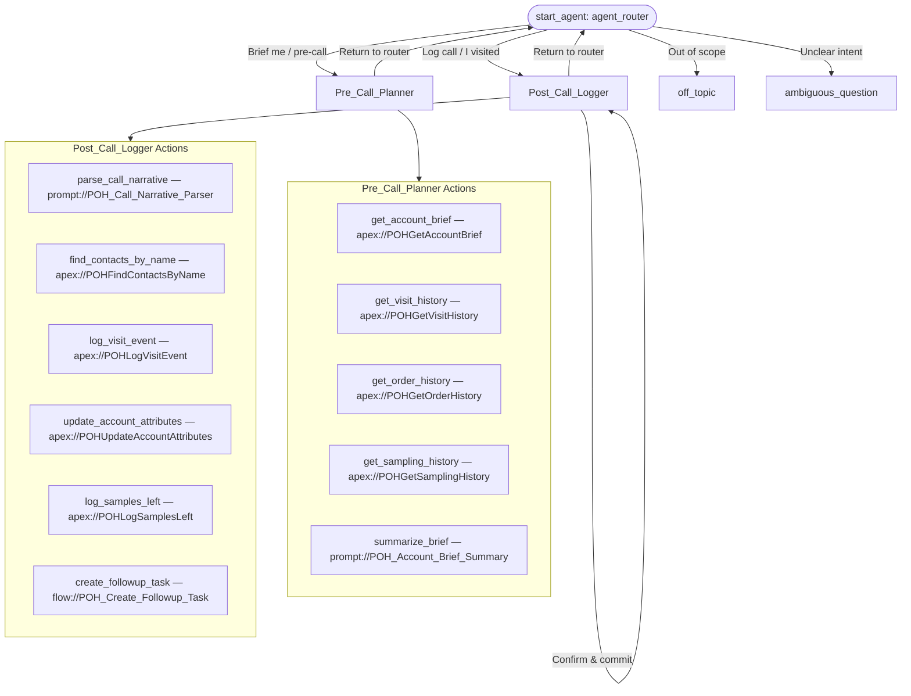

# POH_Sales_Agent — Agent Spec

**Version:** 1.0  
**Status:** AWAITING USER APPROVAL  
**Date:** April 2026  

---

## Purpose & Scope

The POH Sales Companion is a Salesforce **Employee Agent** surfaced on the Account record page and Salesforce Mobile App. It has two distinct modes:

1. **Pre-Call Planning (`Pre_Call_Planner` subagent)** — assembles a narrative brief for a dental practice account, covering profile attributes, 12-month visit history, order history, sampling data, and AI-driven next best actions.
2. **Post-Call Logging (`Post_Call_Logger` subagent)** — accepts a free-form dictated narrative from the rep, extracts structured data through follow-up questions, and commits a logged Event, updates Account attributes, and optionally creates a follow-up Task.

**Out of scope:** competitor recommendations, marketing programs, real-time order placement, Google Reviews (future), non-POH product lines.

---

## Configuration

| Setting | Value |
|---------|-------|
| Agent Type | `AgentforceEmployeeAgent` |
| Developer Name | `POH_Sales_Agent` |
| default_agent_user | N/A — employee agent |
| Permissions verified | Pending (run after deploy) |

---

## Subagent Map

**Transition types:**
- Router → domain subagents: **handoff** (`@utils.transition to`)
- Domain subagents → router: **handoff** (`@utils.transition to`)
- All actions within subagents: deterministic `run` (for pre-call brief assembly) or LLM-driven (for post-call parsing/confirmation)

---

## Variables

| Name | Type | Default | Set By | Read By | Gate |
|------|------|---------|--------|---------|------|
| `account_id` | `mutable string` | `""` | `start_agent` (from context) | all subagents | Pre-call actions gate on this |
| `account_name` | `mutable string` | `""` | `get_account_brief` | all | Display |
| `brief_text` | `mutable string` | `""` | `summarize_brief` | `Pre_Call_Planner` | Controls brief display |
| `call_narrative` | `mutable string` | `""` | Rep dictation (slot-fill) | `Post_Call_Logger` | Gates `parse_call_narrative` |
| `parsed_event_start` | `mutable string` | `""` | `parse_call_narrative` | `log_visit_event` | Pre-populate |
| `parsed_event_end` | `mutable string` | `""` | `parse_call_narrative` | `log_visit_event` | Pre-populate |
| `parsed_contact_names` | `mutable string` | `""` | `parse_call_narrative` | `find_contacts_by_name` | Pre-populate |
| `parsed_notes` | `mutable string` | `""` | `parse_call_narrative` | `log_visit_event` | Pre-populate |
| `parsed_samples` | `mutable string` | `""` | `parse_call_narrative` | `log_samples_left` | Pre-populate |
| `parsed_followup` | `mutable string` | `""` | `parse_call_narrative` | `create_followup_task` | Gates task creation |
| `confirmed_contacts` | `mutable string` | `""` | Rep confirmation | `log_visit_event` | Must be non-empty before logging |
| `event_logged` | `mutable boolean` | `False` | `log_visit_event` | `Post_Call_Logger` | Gates `log_samples_left` and `create_followup_task` |
| `has_followup` | `mutable boolean` | `False` | `parse_call_narrative` | `Post_Call_Logger` | Gates `create_followup_task` |

**Linked variable (from record page context):**

| Name | Type | Source |
|------|------|--------|
| `current_account_id` | `linked string` | `@context.recordId` |

---

## Actions & Backing Logic

### Pre_Call_Planner Subagent

#### 1. `get_account_brief`
| Attribute | Value |
|-----------|-------|
| Target | `apex://POHGetAccountBrief` |
| Status | **NEEDS STUB** (new Apex class) |
| Description | Fetches Account name, billing address, specialty, DDS count, RDH count, dispenses/recommends flags, competitor brands, last iO sample date, and AI Sales Companion recommendation text. |
| Invocation | Deterministic `run` at top of Pre_Call_Planner instructions |

**Inputs:**
| Name | Type | Required | Notes |
|------|------|----------|-------|
| `accountId` | `string` | Yes | Salesforce Account ID |

**Outputs:**
| Name | Type | Visible? | Notes |
|------|------|----------|-------|
| `accountName` | `string` | No (internal) | Stored in `@variables.account_name` |
| `address` | `string` | No (internal) | Included in brief text |
| `specialty` | `string` | No (internal) | — |
| `numDDS` | `integer` | No (internal) | — |
| `numRDH` | `integer` | No (internal) | — |
| `dispensesPower` | `boolean` | No (internal) | — |
| `dispensesManual` | `boolean` | No (internal) | — |
| `recommendsPower` | `boolean` | No (internal) | — |
| `recommendsManual` | `boolean` | No (internal) | — |
| `competitorBrands` | `string` | No (internal) | — |
| `lastIOSampleDate` | `string` | No (internal) | Formatted as string for prompt injection |
| `aiRecommendation` | `string` | No (internal) | AI Sales Companion recommendation text |

---

#### 2. `get_visit_history`
| Attribute | Value |
|-----------|-------|
| Target | `apex://POHGetVisitHistory` |
| Status | **NEEDS STUB** |
| Description | Returns all Events linked to the Account in the past 12 months. Returns count, last visit date, attendees (concatenated first names), and notes from the most recent visit. Explicitly: NO row cap — returns ALL qualifying records using bulkified SOQL. |
| Invocation | Deterministic `run` |

**Inputs:**
| Name | Type | Required |
|------|------|----------|
| `accountId` | `string` | Yes |

**Outputs:**
| Name | Type | Visible? |
|------|------|----------|
| `visitCount` | `integer` | No (internal) |
| `lastVisitDate` | `string` | No (internal) |
| `lastVisitAttendees` | `string` | No (internal) |
| `lastVisitNotes` | `string` | No (internal) |
| `visitHistorySummary` | `string` | No (internal) |

---

#### 3. `get_order_history`
| Attribute | Value |
|-----------|-------|
| Target | `apex://POHGetOrderHistory` |
| Status | **NEEDS STUB** |
| Description | Returns past-12-month Order_Item__c grouped by Product_Family__c and Ship_Plan_Type__c, plus forward-12-month ship plan items. Provides a structured narrative summary string. Explicitly: ALL records returned (no 5-record cap). Time windows: past = Order_Date__c >= TODAY - 365; future = Order_Date__c > TODAY AND Order_Date__c <= TODAY + 365. |
| Invocation | Deterministic `run` |

**Inputs:**
| Name | Type | Required |
|------|------|----------|
| `accountId` | `string` | Yes |

**Outputs:**
| Name | Type | Visible? |
|------|------|----------|
| `pastOrderSummary` | `string` | No (internal) |
| `futureOrderSummary` | `string` | No (internal) |
| `shipPlanType` | `string` | No (internal) |

---

#### 4. `get_sampling_history`
| Attribute | Value |
|-----------|-------|
| Target | `apex://POHGetSamplingHistory` |
| Status | **NEEDS STUB** |
| Description | Returns Sample Drop Order_Item__c records for the past 24 months, grouped by product. Returns last iO sample date and a flag for sampling recency (> 2 years = stale). |
| Invocation | Deterministic `run` |

**Inputs:**
| Name | Type | Required |
|------|------|----------|
| `accountId` | `string` | Yes |

**Outputs:**
| Name | Type | Visible? |
|------|------|----------|
| `sampleHistorySummary` | `string` | No (internal) |
| `ioSampleStaleDays` | `integer` | No (internal) |

---

#### 5. `summarize_brief`
| Attribute | Value |
|-----------|-------|
| Target | `prompt://POH_Account_Brief_Summary` |
| Status | **NEEDS STUB** (new Prompt Template) |
| Description | Takes all account brief components as inputs and produces a single narrative-style POH pre-call brief in the voice defined in the persona document. |
| Invocation | Deterministic `run` after all data actions complete |

**Inputs (Prompt Template format — "Input:" prefix):**
| Name | Type | Notes |
|------|------|-------|
| `"Input:accountName"` | `string` | — |
| `"Input:address"` | `string` | — |
| `"Input:specialty"` | `string` | — |
| `"Input:numDDS"` | `string` | Passed as string for template injection |
| `"Input:numRDH"` | `string` | — |
| `"Input:dispensesPower"` | `string` | — |
| `"Input:dispensesManual"` | `string` | — |
| `"Input:recommendsPower"` | `string` | — |
| `"Input:recommendsManual"` | `string` | — |
| `"Input:competitorBrands"` | `string` | — |
| `"Input:lastIOSampleDate"` | `string` | — |
| `"Input:visitHistorySummary"` | `string` | — |
| `"Input:pastOrderSummary"` | `string` | — |
| `"Input:futureOrderSummary"` | `string` | — |
| `"Input:sampleHistorySummary"` | `string` | — |
| `"Input:aiRecommendation"` | `string` | — |

**Outputs:**
| Name | Type | Visible? |
|------|------|----------|
| `promptResponse` | `string` | Yes — displayed to rep |

---

### Post_Call_Logger Subagent

#### 6. `parse_call_narrative`
| Attribute | Value |
|-----------|-------|
| Target | `prompt://POH_Call_Narrative_Parser` |
| Status | **NEEDS STUB** (new Prompt Template) |
| Description | Takes the rep's free-form call narrative and extracts: event start/end time, contact first names mentioned, notes summary, samples left description, and follow-up action (e.g., Teach & Learn). Returns structured JSON-like string fields. |
| Invocation | LLM-driven (rep triggers via message containing call narrative) |

**Inputs:**
| Name | Type | Notes |
|------|------|-------|
| `"Input:callNarrative"` | `string` | Rep's raw dictated text |
| `"Input:accountName"` | `string` | For context |

**Outputs:**
| Name | Type | Visible? |
|------|------|----------|
| `promptResponse` | `string` | No — parsed internally by agent |

---

#### 7. `find_contacts_by_name`
| Attribute | Value |
|-----------|-------|
| Target | `apex://POHFindContactsByName` |
| Status | **NEEDS STUB** |
| Description | Accepts a comma-separated list of first names and the account ID. For each name, returns ALL matching contacts on the account with their full name, title, and LastModifiedDate. Flags duplicates (>1 match per name). Design constraint: returns the most recently modified contact when duplicates exist, and always surfaces this to the rep for confirmation. |
| Invocation | Deterministic `run` after `parse_call_narrative` completes |

**Inputs:**
| Name | Type | Required |
|------|------|----------|
| `contactFirstNames` | `string` | Yes (comma-separated) |
| `accountId` | `string` | Yes |

**Outputs:**
| Name | Type | Visible? |
|------|------|----------|
| `resolvedContactIds` | `string` | No (internal — comma-separated IDs) |
| `contactSummary` | `string` | Yes — shown to rep for confirmation |
| `hasDuplicates` | `boolean` | No (internal — drives confirmation gate) |

---

#### 8. `log_visit_event`
| Attribute | Value |
|-----------|-------|
| Target | `apex://POHLogVisitEvent` |
| Status | **NEEDS STUB** |
| Description | Creates a new Event record on the Account. Sets WhatId = accountId, WhoId = first confirmed contact ID, StartDateTime, EndDateTime, Subject, Visit_Notes__c, Samples_Left_Summary__c, and Logged_via_Agentforce__c = true. Returns the new Event ID. |
| Invocation | LLM-driven — rep confirms before action fires |

**Inputs:**
| Name | Type | Required |
|------|------|----------|
| `accountId` | `string` | Yes |
| `primaryContactId` | `string` | Yes |
| `startDateTime` | `string` | Yes (ISO format) |
| `endDateTime` | `string` | Yes |
| `subject` | `string` | Yes |
| `visitNotes` | `string` | No |
| `samplesLeftSummary` | `string` | No |

**Outputs:**
| Name | Type | Visible? |
|------|------|----------|
| `eventId` | `string` | No (internal — used by subsequent actions) |
| `confirmationMessage` | `string` | Yes — tells rep what was logged |

---

#### 9. `update_account_attributes`
| Attribute | Value |
|-----------|-------|
| Target | `apex://POHUpdateAccountAttributes` |
| Status | **NEEDS STUB** |
| Description | Updates any Account attributes the rep mentioned in the call narrative (dispenses/recommends flags, competitor brands seen, number of DDS/RDH). Only updates fields that were explicitly mentioned. |
| Invocation | LLM-driven (optional — fires only if rep mentioned changes) |

**Inputs:**
| Name | Type | Required |
|------|------|----------|
| `accountId` | `string` | Yes |
| `dispensesPower` | `boolean` | No |
| `dispensesManual` | `boolean` | No |
| `recommendsPower` | `boolean` | No |
| `recommendsManual` | `boolean` | No |
| `competitorBrands` | `string` | No |
| `numDDS` | `integer` | No |
| `numRDH` | `integer` | No |

**Outputs:**
| Name | Type | Visible? |
|------|------|----------|
| `updateSummary` | `string` | Yes — tells rep what was updated |

---

#### 10. `log_samples_left`
| Attribute | Value |
|-----------|-------|
| Target | `apex://POHLogSamplesLeft` |
| Status | **NEEDS STUB** |
| Description | Creates `Order_Item__c` records with `Ship_Plan_Type__c = 'Sample Drop'` for each product/quantity the rep mentioned. Sets the Visit__c lookup when Event was just created (if available). Also updates `Last_iO_Sample_Date__c` on Account if iO samples were dropped. |
| Invocation | LLM-driven (fires after `log_visit_event` succeeds — gated by `@variables.event_logged`) |

**Inputs:**
| Name | Type | Required |
|------|------|----------|
| `accountId` | `string` | Yes |
| `samplesSummary` | `string` | Yes (natural language, e.g. "12 tubes Crest Gum Detoxify, 1 iO Series 9") |
| `visitDate` | `string` | Yes |

**Outputs:**
| Name | Type | Visible? |
|------|------|----------|
| `samplesLoggedSummary` | `string` | Yes — confirms what was recorded |

---

#### 11. `create_followup_task`
| Attribute | Value |
|-----------|-------|
| Target | `flow://POH_Create_Followup_Task` |
| Status | **NEEDS STUB** (AutoLaunch Flow) |
| Description | Creates a Task linked to the Account (and optionally the just-logged Event). Sets Subject (e.g., "Teach & Learn"), WhatId, DueDate (defaults to 2 weeks out), Logged_via_Agentforce__c = true. |
| Invocation | LLM-driven — gated by `@variables.has_followup == True` AND `@variables.event_logged == True` |

**Inputs (Flow variables):**
| Name | Type | Required |
|------|------|----------|
| `accountId` | `string` | Yes |
| `taskSubject` | `string` | Yes |
| `dueDate` | `date` | No (defaults in Flow) |
| `relatedEventId` | `string` | No |

**Outputs:**
| Name | Type | Visible? |
|------|------|----------|
| `taskId` | `string` | No (internal) |
| `taskConfirmation` | `string` | Yes — "Task created: Teach & Learn, due [date]" |

---

## Gating Logic

| Gate | Type | Condition | Action Protected |
|------|------|-----------|-----------------|
| No account in context | `before_reasoning` guard | `@variables.account_id == ""` | Entire Pre_Call_Planner — transitions to `off_topic` |
| Duplicate contacts detected | Conditional instructions | `@variables.hasDuplicates == True` | Forces rep confirmation before `log_visit_event` |
| Event must be logged before samples | `available when` | `@variables.event_logged == True` | `log_samples_left`, `create_followup_task` |
| Follow-up required | `available when` | `@variables.has_followup == True` | `create_followup_task` |
| Call narrative required | `available when` | `@variables.call_narrative != ""` | `parse_call_narrative` |

---

## Design Constraints (from Customer Issue Analysis)

1. **No record-list caps.** All SOQL in backing Apex uses explicit time windows (not `LIMIT 5` or `LIMIT 10`). Contact lookups return ALL contacts for the account.

2. **Explicit time windows.** All activity and order queries use `>= :cutoffDate` rather than relative activity keywords that the LLM might interpret inconsistently.

3. **Agent Script only — no OOTB topics.** The entire agent is authored in Agent Script. No Out-of-the-Box topics are mixed in. This eliminates the "two topics, different answers" issue the customer reported.

4. **Confirmation-first write pattern.** Every write action (log_visit_event, update_account_attributes, log_samples_left, create_followup_task) is LLM-driven (not `run`). The agent always confirms with the rep before committing.

5. **Duplicate contact handling.** `find_contacts_by_name` returns ALL contacts matching each first name, surfaces duplicates to the rep, and selects the most recently modified one as the default.

---

## Open Items

| Item | Status | Notes |
|------|--------|-------|
| Google Reviews integration | Deferred | No API in scope for MVP |
| Actual P&G AI Sales Companion source | Placeholder field | `AI_Sales_Companion_Recommendation__c` is stand-in |
| Ship plan storage system | Salesforce-native | Using `Order_Item__c` as replica |
| Task vs. Calendar invite for Teach & Learn | Task chosen | Per customer confirmation |

---

## Approval Gate

**This spec must be approved before code generation begins.**

Please review and confirm:
- [ ] Subagent structure (Pre_Call_Planner + Post_Call_Logger hub-and-spoke) matches your vision
- [ ] All 11 actions and their backing logic approach are correct
- [ ] Variable state model is appropriate
- [ ] Gating logic is correct
- [ ] Design constraints reflect the customer issues you want to prevent

**Reply "approved" or provide feedback.**
